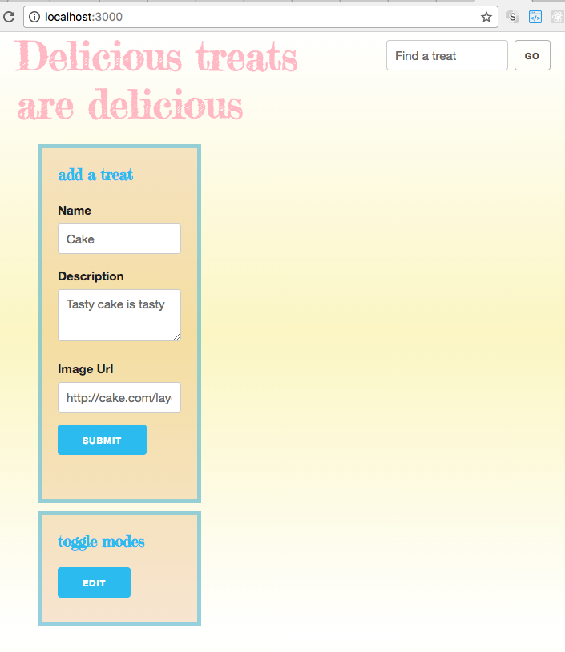
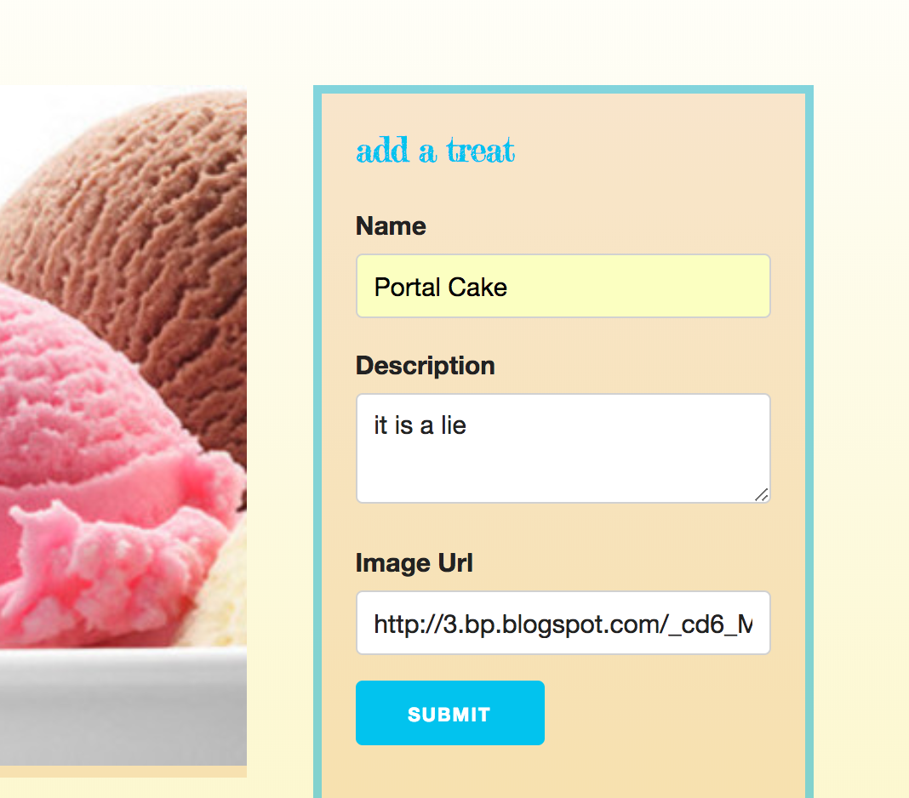
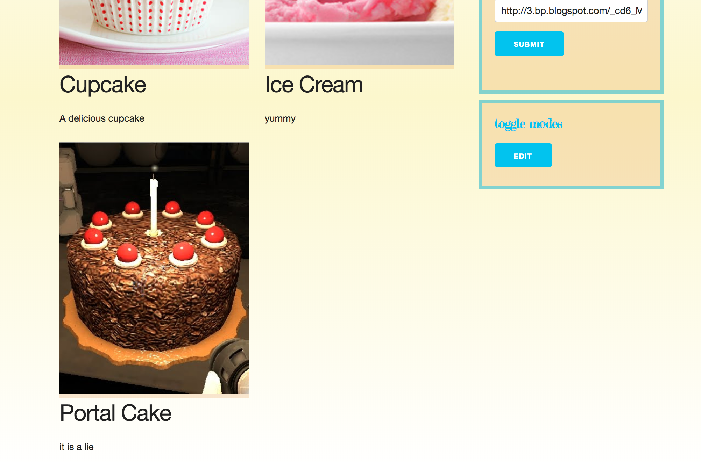

Code Challenge 3: Treats Server-side Code
===

Your front-end developer has created all of the client-side code necessary to view, add, update, and delete treats from the treats database. 

A server-side developer has set-up the server to serve back our static files as well as some initial pg and routing code. But none of the routes are implemented. All clicks on the interface buttons fail.

## Setup

### Client

You should not need to change the client code at all. In fact, it is minimized to discourage you from doing so.

### Server

**IMPORTANT:** Make sure to start postgres!

1. Fork and clone repo.
2. `npm install` to get all dependencies.
3. Setup database as described below.
4. You will need to adjust the pool connection configuration.

### Database

Create a new database named: `sql_code_challenge`

```SQL
CREATE TABLE treats (
	id SERIAL PRIMARY KEY,
	name varchar(255),
	description text,
	pic varchar(255)
);
```
Treats table starter data:

```SQL
INSERT INTO treats (name, description, pic)
VALUES ('Cupcake', 'A delicious cupcake', '/assets/cupcake.jpg'),
('Donuts', 'Mmmm donuts', '/assets/donuts.jpg');
```

Test your project: `npm start` to start server. Open http://localhost:3000/ in your browser and you should see something like the following:



It seems to be missing the data you just created.

## TODO

---

### Base Mode

Create the routes and SQL queries necessary to respond to the requests from the client side to return all treats, add new treats, and to delete treats. 

You will need:

- [ ] `GET /treats` should return all treats from the database.

- [ ] `POST /treats` expects a treat name, description and link to a url image.

Once working you should be able to enter new treat info as such:



After adding the treat the page should update:



And the new info should be in your table:


- [ ] `DELETE /treats/<id>` Deletes a specific treat. Note that the Mode Toggle in the interface will display the delete button for each treat.

- [ ] `PUT /treats/<id>` updates the treat description.

---

### Pro Mode

**If you're feeling fancy and have some time to spare**, try this one. You might need to research query strings and express. 

- [ ] `GET /treats?q=donut` should return only treats that match the query parameter

---

*Remember to use best practices:*

- add, commit, and push working code at regular intervals
- update the project's readme.md

---
